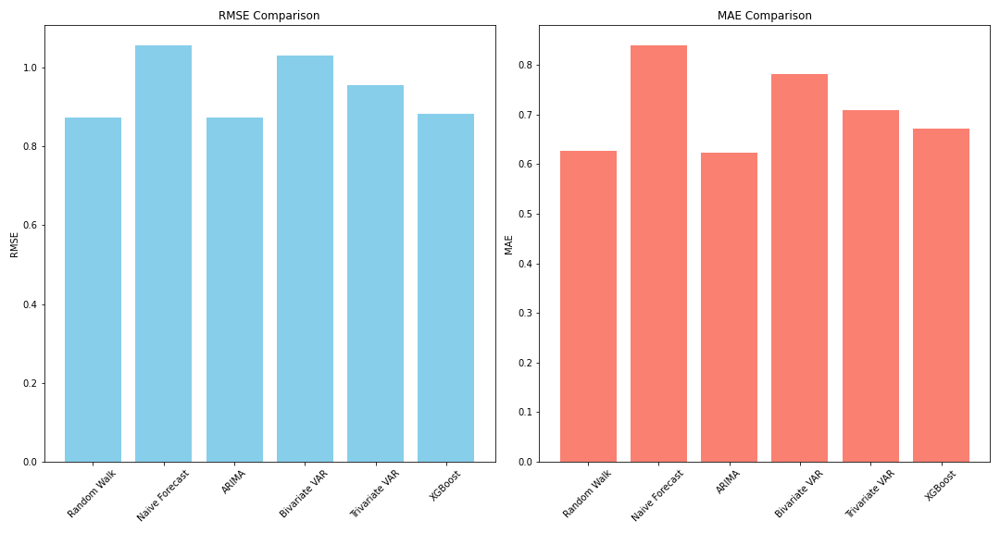

# Inflation Forecasting

This repository contains a Python implementation for forecasting inflation in the UK using multiple machine learning and statistical models. The goal is to predict inflation over a 2-quarter horizon using historical macroeconomic data such as GDP growth, unemployment rate, oil prices, and exchange rates.

## Dataset Description
The dataset used for this analysis is UK macroeconomic data, containing the following variables:

- **Inflation (YoY)** - Quarterly inflation rate (Consumer Price Index).
- **GDP Growth (YoY)** - Quarterly GDP growth rate.
- **Foreign Exchange (FX) Change (YoY)** - Changes in the sterling/dollar exchange rate.
- **Unemployment Rate** - Unemployment rate (in levels) for each quarter.
- **Oil Price (YoY)** - Sterling price of oil on a quarterly basis.

Data was extracted from an Excel file, **'UK DATA.xlsx'**, located in the 'data' folder of the project. The file contains the data in the **'UK DATA'** sheet.

## Model and Forecasting Method
The following models are implemented to forecast inflation:

1. **Random Walk (RW)** - A simple forecasting model using the last observed value.
2. **Naive Forecast** - Assumes a constant 2% inflation for the future.
3. **ARIMA(0,1,1)** - A simple autoregressive integrated moving average model.
4. **Bivariate VAR(2)** - A vector autoregressive model using inflation and unemployment.
5. **Trivariate VAR(2)** - A vector autoregressive model using inflation, exchange rate, and oil prices.
6. **XGBoost** - A gradient boosting model using unemployment, exchange rate, and oil prices as features.
   
Each model uses a 15-year estimation window (R = 15 * 4 quarters) and is trained separately with a rolling window approach, where the model is updated with each new quarter of data. It then computes a 2-step ahead forecast for inflation, providing predictions for two quarters in advance based on the most recent available data.

## Results
The performance of the models were evaluated using two metrics: the **RMSE (Root Mean Squared Error)** and the **MAE (Mean Absolute Error)**. The following performance metrics were computed for each model:

| Model                | RMSE   | MAE   |
|----------------------|--------|-------|
| Random Walk          | 0.8719 | 0.6260|
| Naive Forecast       | 1.0553 | 0.8387|
| ARIMA                | 0.8736 | 0.6221|
| Bivariate VAR        | 1.0307 | 0.7816|
| Trivariate VAR       | 0.9541 | 0.7095|
| XGBoost              | 0.8814 | 0.6707|

The Random Walk model had the best performance based on the RMSE, but the **ARIMA model performed well in terms of both RMSE and MAE**.

## Plots
The following plots are generated in this project:

1. **Real vs. Forecasted Inflation**: Comparison of real inflation data with forecasts from all models.
   
2. **RMSE and MAE Comparison**: A bar plot showing the RMSE and MAE of each model.
   
3. **Forecast Errors**: A plot comparing the forecast errors for all models.
   
4. **Weighted Forecast**: A combined forecast that uses weights proportional to the RMSE of each model.
   

All plots are saved as PNG images in the 'figures' folder.

## Possible Future Steps

1. **Model Refinement**: Explore different modeling techniques and improve the prediction accuracy for inflation forecasts. This could involve experimenting with more advanced time series models or machine learning-based models.  
2. **External Data Sources**: Integrate additional macroeconomic indicators or external datasets that might improve the forecast, such as interest rates, housing market data, or global economic indicators.
3. **Extended Forecasting Horizon**: Extend the forecasting horizon beyond two steps ahead, allowing for longer-term inflation predictions. 
4. **Automation**: Automate the entire forecasting pipeline by integrating it with a database that continuously updates the macroeconomic data, enabling real-time inflation forecasting.
5. **Visualization Enhancements**: Add interactive data visualizations, such as interactive plots or dashboards, to help users better understand the results and trends in the inflation forecast.

## Requirements
To run the code, you will need the following Python libraries:

- `numpy`
- `pandas`
- `matplotlib`
- `statsmodels`
- `xgboost`

## License
This project is licensed under the MIT License.
